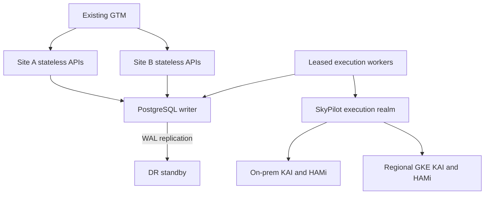

# GRACE MVP decisions and acceptance gates

Owner clarification: 2026-09-09. This decision set supersedes earlier inferred
location behavior, Azure MVP scope and priority defaults. It defines the enterprise
target and the prototype contract separately. GRACE remains **GPU Reservation,
Allocation & Control Engine**.

## Delivery boundary

The executable is a single-process, memory-backed simulation with real REST/gRPC
transports. Its request queue, allocation ledger, idempotency records and effective
policy snapshots are volatile. Its Helm deployment deliberately stays at one replica.
Unit, PostgreSQL schema and Kind API tests prove only their documented scopes.
The stateless, PostgreSQL-backed service, authenticated admin policy API, live
SkyPilot/KAI enforcement, enterprise Okta and cross-site DR remain delivery gates.
Adding PostgreSQL pods or GTM routing to this simulator does not make it durable.

## Confirmed scope

| Decision | MVP contract | Deferred or separately gated |
|---|---|---|
| Location | User chooses `strict`, `preferred`, or `any` for each request | Cross-environment or unapproved data movement |
| Infrastructure | Existing on-prem Kubernetes and GPU GKE clusters across multiple regions | Azure/AKS, direct GPU VMs, automatic cluster creation |
| Capacity | Best-effort queueing; all requests equal priority by default | Guaranteed start, future capacity holds or throughput SLA |
| Priority | Admin-defined project/BU policy if needed; user sees effective policy | User-controlled priority or client-supplied exemptions |
| Identity | Active Directory supplies identity; Okta supplies validated OIDC tokens | Forwarding AD passwords; accepting an unsigned identity header |
| Cost | Showback with immutable ownership/rate facts | Chargeback until finance-approved allocation and correction workflows |
| Protection | Admin-configurable high-priority victim exemption; independently visible idle policy | Immunity from owner cancellation, hard expiry or node failure |
| Sharing | Fractional KAI with certified HAMi, no MIG | Assuming an accounting fraction is a guaranteed performance fraction |
| Recovery | Stateless API replicas behind existing GTM; authoritative PostgreSQL DR | Independent active writers; reopening solely because GTM or DB is healthy |

Dev/QA remain the initial lifecycle environments. Production is a separately
authorized deployment and request capability; priority does not implicitly enable
production, and a production flag never changes a cluster's lifecycle environment.

## Location and queue request contract

Use one explicit `location_policy` enum rather than overlapping booleans such as
`strict=true` and `allow_spillover=true`. REST uses lowercase values; protobuf uses
the equivalent typed enum. `location` names a registered location identifier, not
a user-supplied Kubernetes API endpoint. Read the generated contract and
[API design](api-design.md) for the complete request shape.

| Parameter | Behavior |
|---|---|
| `location_policy="strict"`, `location` selected | Only that location is eligible; capacity shortage queues there |
| `location_policy="preferred"`, `location` selected | Rank it first, then approved alternatives if no placement fits |
| `location_policy="any"`, no `location` | Rank any eligible existing on-prem/GKE location |
| `preferred` without a location | Reject as invalid input |
| `any` with a location | Reject ambiguity; do not silently discard the supplied location |
| Legacy default `strict` with no location | Normalize to effective `any`; response must make the effective policy clear |
| `wait_for_capacity=true` | Default: accept a feasible request into the bounded best-effort queue when busy |
| `wait_for_capacity=false` | Return capacity exhausted when it cannot be allocated immediately |
| `queue_timeout_seconds=3600` | Default maximum queue wait; configured bounds prevent indefinite retained intent |

Authorization, requested lifecycle environment, GPU model/memory/topology, data
attestation, residency, runtime certification and inventory freshness filter every
mode. The user must attest data availability in each eligible location for MVP;
permission to spill never asserts that the dataset exists there. An eligible
alternative may be on-prem or GKE, but never an unapproved cluster or Azure.

Spillover is placement selection before dispatch or a controlled handoff after
proven teardown/fencing. A SkyPilot timeout after submission leaves an uncertain
attempt holding its claim. It must not trigger a duplicate workload elsewhere.

Queue ordering is per tenant/environment: effective priority descending, then
creation/insertion order, with deterministic backfill past requests that do not
fit. All priorities are equal until an admin configures overrides. This is
oldest-fit behavior, not a guaranteed FIFO start sequence; large or restricted
requests can wait longer. Expose queue age, reason, deadline and selected policy.
Bound queue length and tenant submission rate; do not silently convert unlimited
waiting into a capacity promise. A queue entry reserves no physical GPU.

When capacity becomes free, revalidate policy, authorization, data and fresh
infrastructure evidence before acquiring an allocation. The durable release must
commit queue-to-allocation transition, capacity claim and command outbox together,
then call SkyPilot outside the transaction. Simulator acceptance is explicitly
non-durable. Queue cancellation requires no remote teardown; allocation release
still requires observed absence and device readiness.

## Priority, preemption and idle reclamation

These controls solve different problems and are represented separately:

| Effective field | Authority and meaning |
|---|---|
| `priority` | Admin-owned ordering value; equal default, optional project/BU override |
| `preemption_enabled` | Global/admin gate for scheduler eviction behavior; initially false |
| `preemption_exempt` | Workload cannot be a KAI scheduler victim under the certified policy |
| `idle_reclamation_exempt` | GRACE will not reclaim this workload based on idle heuristics |
| `policy_id`, `version` | Auditable provenance for the decision shown to the user |

Resolve project policy before BU policy before the global default. Project
membership is checked against the authenticated caller; BU is derived from
verified entitlement mapping. A requester may select an authorized project but
cannot submit an effective priority or exemption. Queue priority, workload
priority, fair-share weight and quota are distinct KAI concepts; an adapter must
translate an admin policy deliberately rather than treating them as synonyms.

The user requires high-priority workloads to be protected from preemption.
Recommended admin default: a high-priority protected class also has idle
reclamation exemption. Admins may configure the idle exemption independently;
it is not an unstated consequence of priority. Display both resolved exemptions,
queueing behavior, expiry and policy version before submission and on status.
Hard expiry, authorized cancellation, security intervention and physical failure
remain separate events. Protection is not a minimum-compute or start-time guarantee.

KAI v0.17's documented fallback treats PriorityClass values at least 100 as
non-preemptible and restricts those workloads to queue quota. Its tagged code also
honors explicit PodGroup preemptibility ahead of the fallback threshold. GRACE must
validate the installed CRD/controller path, effective PodGroup and quota behavior;
a policy flag in the ledger alone cannot enforce victim protection.
[KAI v0.17 priority contract](https://github.com/kai-scheduler/KAI-Scheduler/blob/v0.17.0/docs/priority/README.md),
[tagged preemptibility implementation](https://github.com/kai-scheduler/KAI-Scheduler/blob/v0.17.0/pkg/common/podgroup/preemptible.go).

Do not implement victim immunity by setting Kubernetes `preemptionPolicy: Never`.
That setting prevents a pod from initiating preemption; higher-priority pods can
still preempt it. A PodDisruptionBudget is also not a complete victim-exemption
mechanism. Protection must be verified against the actual scheduler's victim
selection. [Kubernetes priority semantics](https://kubernetes.io/docs/concepts/scheduling-eviction/pod-priority-preemption/#non-preempting-priorityclass).

Initially disable scheduler-driven eviction for managed MVP pools and retain equal
workload/queue defaults. Do not inherit KAI's workload-type defaults implicitly.
Before admins enable differentiated preemption, test protected and preemptible
workloads in the same and different queues, including quota pressure. If a requested
protection cannot be certified, block that dispatch rather than downgrade protection.
The prototype exposes policy decisions; it does not mutate live KAI configuration.

## Fractional GPU and onboarding contract

Keep integer millicards for fractions and MiB for memory. The accounting invariant
is at most 1000 millicards per physical GPU, with individually feasible memory
working sets. Existing on-prem and regional GKE pools must use the certified KAI
and HAMi path for the requested enforced sharing mode. No MIG setup is assumed.

KAI v0.17's HAMi integration provides the memory-cap path; an SM-utilization cap
requires a separately verified runtime capability. Verify library injection,
effective CUDA settings, denied over-budget allocation, approved images and
anti-opt-out admission. A version number or environment variable by itself is not
runtime evidence. [Pinned KAI HAMi guide](https://github.com/kai-scheduler/KAI-Scheduler/blob/v0.17.0/docs/gpu-sharing/hami/README.md).
The [HAMi capability contract](hami.md) details existing adapter behavior and
remaining real-GPU gates. Software-enforced CUDA caps do not establish hardware
fault isolation or guarantee an equal share of completed work.

Onboarding stays declarative: register disabled descriptor; discover GPUs and
current consumers; validate identity, KAI/HAMi, admission, metrics and data rules;
run canary allocate/cancel/release; certify and enable. An unsuccessful new region
stays quarantined without disrupting existing regions. Registry changes invalidate
only affected capability evidence. Drain and unregister retain active claims until
release is observed. Credentials stay in approved secret/workload-identity systems.

## Stateless entry point and durable recovery

The existing GTM is the front door. The target deploys stateless REST/gRPC API pods
at eligible sites, with one authoritative PostgreSQL writer and DR standby. API
pods hold only disposable connection pools and caches; the shared ledger owns
reservation intent, queue state, policy snapshots, operation/idempotency records,
leases, inventory provenance, notification intent and transactional outbox.

This is a target topology, not a claim that the present single-pod simulator is
stateless. Deploy API replicas only after the PostgreSQL repository passes
concurrency and restart tests. Workers may run as replaceable pods but require
fenced ownership in PostgreSQL and at the execution boundary. SkyPilot's own
controller/database/files have their separate supported persistence and restore
contract; do not scale it as stateless merely because GRACE APIs can scale.

A GTM route change does not establish a unique database writer or execution owner.
PostgreSQL's failover guidance explicitly requires stopping a returned former
primary from acting as a concurrent writer. Use the selected HA platform's proven
fencing mechanism; a DNS update or recovered integer epoch by itself is insufficient.
[PostgreSQL failover guidance](https://www.postgresql.org/docs/current/warm-standby-failover.html).

Write readiness requires the correct schema, current writer/authority epoch,
validated configuration and open recovery gate. A site disconnected from the writer
must become unavailable for mutations; it must not create a local writer. Preserve
process liveness independently so a database incident does not cause restart storms.
An unreachable workload cluster quarantines that pool rather than every healthy pool.
GTM checks the appropriate readiness endpoint; regional ingress must support the
actual REST and HTTP/2/gRPC transport used by clients.

Established gRPC streams do not move when DNS/GTM changes. Clients require bounded
deadlines, re-resolution/reconnection, and retries with the same idempotency key for
mutations. A lost response can follow a successful commit; query the authoritative
operation before interpreting timeout as failure. All accepted asynchronous work
must survive removal of every API replica. No session affinity is required for
correctness in this durable target.

After site loss: close admission; fence old writer and dispatchers; promote/restore
PostgreSQL with measured recovery point; recover policy/outbox and supported SkyPilot
state; inventory surviving GPU workloads; adopt or quarantine unknown claims; canary
safe allocation/release; reopen eligible pools and GTM write readiness. Async recovery
can lose claims while jobs survive, so an empty restored ledger never proves GPUs
are free. The [operations runbook](operations.md) covers old-site return and failback.

No numeric SLO/RPO/RTO was approved in this clarification. Retain planning proposals
only: dev/QA API 99.9% monthly; synchronous acknowledged-write failover RPO 0 and RTO
up to 5 minutes; asynchronous site-loss RPO up to 5 minutes and service RTO up to
60 minutes. Measure RTO through reconciliation and safe reopening, not merely GTM
routing or DB promotion. Final objectives depend on the existing GTM and PostgreSQL
platform, replication latency, recovery drills and workload impact. Application
datasets/checkpoints have their own recovery objectives.

## Deliverables and acceptance gates

| Gate | Deliverable | Required evidence |
|---|---|---|
| D1: Request contract | Location modes, bounded best-effort queue, visible effective policy | REST/gRPC parity; strict never spills; preferred respects data; queue expiry/cancellation/replay; unsupported provider denied |
| D2: Authority | PostgreSQL runtime repository, durable queue/idempotency/outbox | Concurrent fractional claims across API replicas; response-loss replay; all APIs restarted without losing intent |
| D3: Identity and admin policy | Okta/AD entitlement mapping, admin policy CRUD/audit, immutable snapshots | Wrong issuer/audience denied; forged project/priority rejected; project-to-BU precedence and visible provenance |
| D4: Existing-pool execution | One on-prem and at least two regional GKE registrations with SkyPilot/KAI/HAMi | Physical fractional CUDA limits, anti-bypass, canary teardown, safe region spillover and no duplicate uncertain attempt |
| D5: Protection | Certified KAI policy and independent GRACE idle policy | Protected victim survives competing queues/quota pressure; ordinary eligible victim behavior; idle exemption respected; hard expiry/cancel remain explicit |
| D6: Stateless/DR | GTM ingress, shared writer authority, backups and supported executor recovery | Kill API site with open gRPC channel; old-writer return denied; async lost-claim recovery; safe readmission and measured RPO/RTO |
| D7: Showback | Usage/rate facts with BU/project attribution and replay | Fractions reconcile to device/pool totals without duplicated parent costs; corrected facts replay deterministically |

D1 simulator behavior is executable contract work, not evidence for D2–D6. The
[delivery plan](delivery/execution-plan.md) and tracker record actual completion.
No new issue tracker, production service or permanent agent is implied by this plan.
